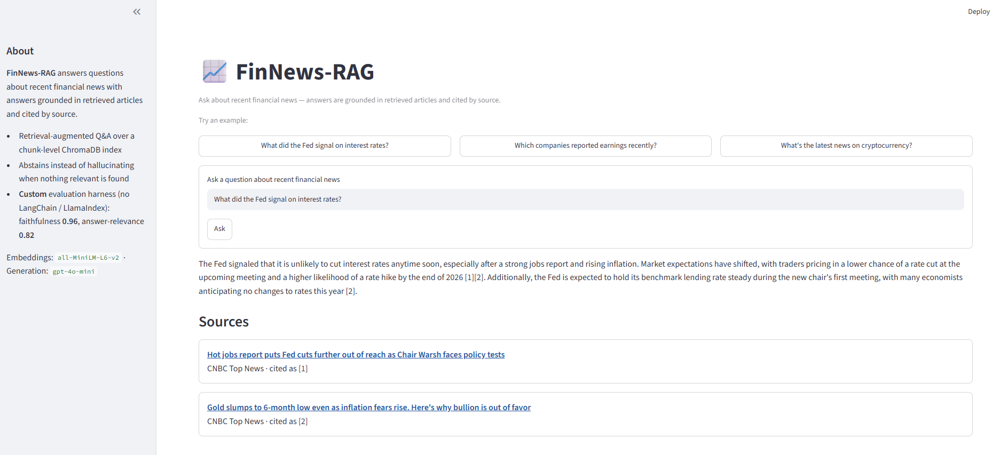

# FinNews-RAG — Retrieval-Augmented Financial News Q&A with a Self-Evaluation Harness

> A retrieval-augmented generation (RAG) system that ingests financial news, answers
> grounded questions with inline source citations, and — critically — **measures its own
> quality** through a custom evaluation harness covering retrieval precision/recall,
> answer faithfulness, answer relevance, and latency/cost across configurations.



---

## Why this project exists

Most RAG demos stop at *"it returns an answer."* Production LLM systems live or die on
whether that answer is **correct**, **grounded**, and **affordable**. This project treats
evaluation as a first-class component: every knob that matters (chunk size, retrieval
depth, embedding model) is scored against a hand-labeled test set, so tuning decisions are
evidence-based rather than vibes-based.

The domain is financial news because I wanted a fast-moving, citation-sensitive corpus
where a wrong or unsupported answer is obviously wrong — exactly the setting where
faithfulness measurement earns its keep.

---

## What it does

1. **Ingests** financial news from **7 curated free RSS feeds** (CNBC, Yahoo Finance, BBC
   Business, The Guardian Business, CoinDesk, Federal Reserve press releases, SEC press
   releases), with the World News API free tier as a secondary fallback when RSS yield is
   low. Full article text is recovered with a `trafilatura → newspaper3k → readability`
   fallback chain.
2. **Deduplicates** in three stages — canonical-URL match, content hash, then embedding
   cosine-similarity — so near-duplicate wire stories don't pollute retrieval.
3. **Chunks and embeds** articles (~256-token chunks, ~15% overlap), storing chunk-level
   vectors in ChromaDB keyed `{article_id}:{chunk_index}`.
4. **Retrieves** the top-k most relevant chunks for a query and generates a **grounded,
   source-cited answer** with `gpt-4o-mini`, constrained to answer only from retrieved
   context. When nothing relevant is retrieved it **abstains** instead of fabricating.
5. **Evaluates** itself across multiple metrics and configurations (see
   [Evaluation](#evaluation-the-core-differentiator)).

*Secondary feature (inherited from the original MVP): a scheduled **daily briefing
report** that summarizes the day's financial news into a structured Markdown/HTML digest.*

---

## Architecture

```
[RSS + World News] --> [Ingest + clean + dedupe] --> [Chunker] --> [Embeddings] --> [ChromaDB]
                                                                                        |
User query ------------------------------------------------> [Retriever (top-k)] <------+
                                                                     |
                                                                     v
                                                    [Grounded prompt + gpt-4o-mini]
                                                                     |
                                                                     v
                                             [Cited answer + abstention on empty context]
                                                                     |
                                                                     v
                                    [Evaluation harness] --> [Metrics + config comparison]
```

Citations are built from the **retrieved chunks**, not from the model: the LLM picks which
source *numbers* it used, and the system maps each number back to the authoritative
`article_id` / `url`. The model can mis-number a citation but cannot fabricate its target.

`src/pipeline.py` is the single orchestrator for ingest → index → brief; the RAG path
(`retriever → qa`) and the eval path read the same ChromaDB index but run independently.

---

## Tech stack

| Layer | Choice |
|---|---|
| Language | Python 3.11 |
| Orchestration | **None** — direct OpenAI / ChromaDB / sentence-transformers calls (no LangChain / LlamaIndex) |
| Vector store | ChromaDB (persistent, chunk-level) |
| Embeddings | sentence-transformers `all-MiniLM-L6-v2` (local, free) |
| Generation LLM | OpenAI `gpt-4o-mini` (`temperature=0`) |
| Evaluation | **Custom** harness implementing the RAGAS metric *definitions* — no RAGAS/LangChain dependency |
| Storage | SQLite (article store) + ChromaDB (vectors) |
| Interface | Streamlit (demo) · FastAPI (briefing API) · APScheduler (daily job) |

Evaluation is deliberately hand-built: it computes retrieval precision/recall/MRR itself
and implements the RAGAS **definitions** of faithfulness and answer-relevance with direct
`gpt-4o-mini` + MiniLM calls, keeping the "no orchestration framework" decision intact and
showing the internals rather than hiding them behind a library.

---

## Evaluation (the core differentiator)

The harness scores the pipeline against `eval/testset.jsonl` — **93 hand-labeled queries**
(q001–q093). Relevance is labeled at the **article** level: a retrieved chunk counts as
relevant if its source article is labeled relevant. Out-of-domain queries (empty relevant
set) are scored separately as **abstention** and never folded into precision/recall.

**Metrics**

- **Retrieval precision / recall / MRR** (custom, ~free — local MiniLM + local ChromaDB),
  reported per-k with latency p50/p95.
- **Faithfulness** = `supported_claims / total_claims`. The answer is decomposed into
  atomic claims (1 LLM call) and each is verified against the numbered context (1 batched
  call). Implements the RAGAS definition without the RAGAS library.
- **Answer relevance** = mean cosine similarity between the original query and N=3
  reverse-questions generated *from the answer*, embedded with MiniLM. Noncommittal answers
  score 0.
- **Latency & cost** — per-query timing and token/$ estimate. Judge calls are cached on
  disk (`temperature=0`), so warm re-runs are free and deterministic.

**Headline numbers** (default config: chunk 256 / top_k 5 / MiniLM):

| Metric | Value |
|---|---|
| Faithfulness | **0.965** (n=78) |
| Answer relevance | **0.818** (n=78) |
| Retrieval recall @5 | 0.795 |
| Retrieval hit-rate @5 | 0.807 |
| MRR @5 | 0.741 |
| Retrieval precision @5 | 0.329 |
| Latency p50 (embed + query) | ~24 ms |
| Cost per cold judge run | ~$0.05 |

**Key findings — multi-config sweep** (OFAT over chunk_size × top_k, 5 configs, ~$0.24):

- **No configuration beats the default by more than judge noise on faithfulness** (all
  configs land in a 0.938–0.981 band ≈ the judge's own variance). The evidence-based
  recommendation is to **keep the defaults** (chunk 256 / top_k 5 / MiniLM).
- Clean, interpretable per-axis trade-offs did emerge:
  - **top_k ↑** → recall ↑ / precision ↓, while generation metrics stay flat — the LLM is
    robust to a few extra retrieved chunks.
  - **chunk_size ↑** → faithfulness ↑ but retrieval ↓ (an inverse relationship; 256 tokens
    sits at the knee, and also matches MiniLM's truncation cap).

The winner call leans on the **bias-free generation metrics**, because retrieval
precision/recall carry a known **pooling bias** (labels were pooled from the baseline
config). Full write-up: [`doc/ship-h-findings.md`](doc/ship-h-findings.md).

---

## Setup

```bash
git clone https://github.com/kwu5/FinNews-RAG.git
cd FinNews-RAG

python -m venv .venv
.venv\Scripts\activate               # Windows  (POSIX: source .venv/bin/activate)
pip install -r requirements.txt
python -m spacy download en_core_web_sm

cp .env.example .env                 # then add your API keys
```

**Environment variables** (`.env`):

| Variable | Purpose |
|---|---|
| `NEWS_API_KEY` | World News API key (secondary ingestion fallback) |
| `OPENAI_API_KEY` | OpenAI key — grounded answer generation + LLM-judge |
| `DATABASE_URL` | SQLite article store (default `sqlite:///./data/news.db`) |
| `CHROMA_PERSIST_DIR` | ChromaDB persistence dir (default `./data/chroma`) |

**Never commit real API keys.** `.env` is gitignored; `.env.example` holds placeholders.

---

## Usage

```bash
# Ingest + index + daily briefing — one synchronous pipeline run
python main.py --mode run-once       # fetch → clean → dedupe → chunk → embed → index → brief

# RAG demo — grounded, source-cited Q&A over the chunk index
streamlit run app.py

# Evaluation harness
python evaluate.py                   # retrieval P/R/MRR + latency at served top_k (+ k-sweep)
python evaluate.py --judge           # generation eval: faithfulness + answer-relevance
python evaluate.py --sweep           # multi-config OFAT sweep (throwaway indexes)
#   flags: --top-k, --k-sweep "1,3,5,10", --gen-sample N, --testset PATH, --out DIR

# Daily briefing as a service
python main.py --mode api            # FastAPI server (:8000) + daily scheduler
python main.py --mode scheduler      # scheduler only (blocking loop)
```

Ingestion has no standalone mode — it runs as the first stage of the pipeline
(`run-once` / `api` / `scheduler`). Eval reports write to `output/eval/` (gitignored).

---

## Repository layout

```
main.py               Entry point — argparse → api | run-once | scheduler
app.py                Streamlit RAG demo
evaluate.py           Eval CLI — retrieval / --judge / --sweep
config/feeds.yaml     Curated RSS feed list

src/
├── config.py         Pydantic Settings (env-driven: keys, paths, chunk/top_k)
├── pipeline.py       run_pipeline(): full ingest → dedupe → index → brief
├── ingestion/        RSS reader (primary) · full-text extractor · World News API (fallback)
├── processing/       cleaner/NER · URL canon · content hash · embedding dedup · embeddings
├── storage/          SQLite (SQLAlchemy) · ChromaDB wrapper
├── rag/              chunker · retriever · qa (grounded cited answers)
├── summarization/    LLM client (answers + judge + briefing) · report generator
├── evaluation/       testset · metrics · harness · judge · judge_cache · sweep
├── api/              FastAPI (daily briefing endpoints)
└── scheduler/        APScheduler daily job

eval/testset.jsonl    93 hand-labeled queries (committed ground truth)
tests/                unit + smoke tests
```

A comprehensive current-state walkthrough lives in
[`doc/PROJECT_GUIDE.md`](doc/PROJECT_GUIDE.md); the ordered roadmap and locked decisions
are in [`IMPLEMENTATION_PLAN.md`](IMPLEMENTATION_PLAN.md).

---

## Roadmap

Delivered in ordered 3-day "ships" (detail in `IMPLEMENTATION_PLAN.md`):

- [x] Ingestion + storage + embedding pipeline (inherited MVP, RSS-first overhaul)
- [x] Dedup stages 1–2 (URL canon + content hash)
- [x] Chunking + chunk-level ChromaDB retrieval
- [x] Grounded, source-cited Q&A + Streamlit demo
- [x] Hand-labeled test set (93 query/relevant-article pairs)
- [x] Eval harness — retrieval P/R/MRR + latency
- [x] Eval harness — faithfulness + answer-relevance (custom LLM-judge)
- [x] Multi-config OFAT sweep + written findings
- [ ] Streamlit polish + demo screenshot *(in progress)*
- [ ] Test-set audit (assistant-labeled half + pooling misses) · union-pooling re-label
- [ ] *(Stretch)* Distance relevance-floor abstention tuning
- [ ] *(Stretch)* Structured signal extraction (entities/tickers, event types, sentiment)

---

## Notes & limitations

- **The LLM-judge is itself an LLM** — faithfulness/relevance are estimates with their own
  variance (the ~0.04 sweep band is roughly judge noise). `temperature=0` + caching pin
  replays, but treat the numbers as direction, not certainty.
- **Pooling bias on retrieval recall** — labels were pooled from the baseline config, so
  alternative configs are scored against a relevant-set that never saw what they surfaced.
  Generation metrics are immune; union-pooling to fix this is planned.
- **Small test set** — 93 queries, one embedding model. The embedding-model axis (e.g.
  `all-mpnet-base-v2`) is the highest-value experiment not yet run.
- **~10% full-text extraction failures** (`trafilatura`/`newspaper3k`) — those articles are
  dropped rather than indexed partially.
- Free-tier RSS / World News API rate limits cap ingestion at ~30 articles per run.
- This is a learning / portfolio project, not enterprise financial infrastructure.

---

## License

MIT
